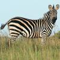

jquery-ui-memory-game
=====================

Jquery plugin (widget) for creating "memory" card games from a list of links and images.

See it in action: http://matteosistisette.github.io/jquery-ui-memory-game


Requirements
------------

To be able to use the plugin, place the downloaded `css` and `js` folders in the webroot of your page, and paste this code into the `<head>` of your html:
```html
<!-- DEPENDENCIES: jQuery and jQuery-UI -->
<script src="https://code.jquery.com/jquery-2.2.4.js"></script>
<script src="https://code.jquery.com/ui/1.11.4/jquery-ui.js"></script>

<!-- INCLUDE THE PLUGIN (js and css) -->
<link rel="stylesheet" href="css/jquery.memory-game.css">
<script src="js/jquery.memory-game.js"></script>
```

    
Basic usage
-----------
There are two ways of building a "Memory" card game using this plugin:
- Build the list of cards through **HTML markup** (links wrapped around images), and convert it into a Memory game with one simple line of JavaScript
- or, define the list of cards as a **JavaScript array** and pass it as a parameter to the widget constructor

###Using HTML markup
See complete live example here: [http://jsbin.com/kawipa](http://jsbin.com/kawipa/edit?html,output)

HTML markup:
```html
<div id="memory-game">
  <a href="http://en.wikipedia.org/wiki/Iguana"></a>
  <a href="http://en.wikipedia.org/wiki/Panda"></a>
  <a href="http://en.wikipedia.org/wiki/Lemur"></a>
  <a href="http://en.wikipedia.org/wiki/Penguin"></a>
  <a href="http://en.wikipedia.org/wiki/Polar_bear"></a>
  <a href="http://en.wikipedia.org/wiki/Rabbit"></a>
  <a href="http://en.wikipedia.org/wiki/Rhinoceros"></a>
  <a href="http://en.wikipedia.org/wiki/Common_seal"></a>
  <a href="http://en.wikipedia.org/wiki/Zebra"></a>
</div>
```

JavaScript code:
```html
<script>
$(function(){
    $("#memory-game").memoryGame();
});
</script>
```

**NOTE:** The size of the card images in pixels must be known (and fixed) when the widget is instantiated. That's why we need the explicit `width` and `height` html attributes, at least on the first image; alternatively, CSS could be used. See below for more details and alternatives.

###Using a JavaScript array
See complete live example here: [http://jsbin.com/vonaye](http://jsbin.com/vonaye/edit?html,output)

HTML markup (just a container):
```html
<div id="memory-game"></div>
```
    
JavaScript code:
```html
    <script>
    $(function(){
      $("#memory-game").memoryGame({
        cards: [
          {
            imageUrl: 'example-images/iguana.jpg',
            linkUrl: 'http://en.wikipedia.org/wiki/Iguana'
          },
          {
            imageUrl: 'example-images/panda.jpg',
            linkUrl: 'http://en.wikipedia.org/wiki/Panda'
          },
          {
            imageUrl: 'example-images/lemur.jpg',
            linkUrl: 'http://en.wikipedia.org/wiki/Lemur'
          },
          {
            imageUrl: 'example-images/penguins.jpg',
            linkUrl: 'http://en.wikipedia.org/wiki/Penguin'
          },
          {
            imageUrl: 'example-images/polarbear.jpg',
            linkUrl: 'http://en.wikipedia.org/wiki/Polar_bear'
          },
          {
            imageUrl: 'example-images/rabbit.jpg',
            linkUrl: 'http://en.wikipedia.org/wiki/Rabbit'
          },
          {
            imageUrl: 'example-images/rhino.jpg',
            linkUrl: 'http://en.wikipedia.org/wiki/Rhinoceros'
          },
          {
            imageUrl: 'example-images/seal.jpg',
            linkUrl: 'http://en.wikipedia.org/wiki/Common_seal'
          },
          {
            imageUrl: 'example-images/zebra.jpg',
            linkUrl: 'http://en.wikipedia.org/wiki/Zebra'
          }
        ],
        cardWidth: 100,
        cardHeight: 100
      });
    });
    </script>
```

**NOTE:** if you use this method, you have to specify the card image height and width via the `cardWidth` and `cardHeight` parameters.

Styling
-------

To change the appearence of the cards, just add your own **CSS stylesheet** to override the default style rules applied by the plugin.

You can place your stylesheet inside a `<style></style>` tag, or in a css file linked via `<link rel="stylesheet">`. Just make sure to put your style **after** the link to `js/jquery.memory-game.css`.

Here's an example:
```html
<style>
.card.back, .card.front {
  border: solid 4px #272;
  border-radius: 12px
}
.card.back {
  background: url('example-images/back.jpg');
} 
.card.front {
  border-color: #472a09;
}
</style>
```

See it live here: [http://jsbin.com/cupefu](http://jsbin.com/cupefu/edit?html,output)


Handling events
---------------

See complete live example here: [http://jsbin.com/puxafos](http://jsbin.com/puxafos/edit?html,output)

You may want to make something happen every time a new pair of matching cards is succesfully disclosed. You do so by passing in a callback function as the **`onPairDisclosed`** parameter:
```html
    <script>
    $(function(){
      $("#memory-game").memoryGame({
        onPairDisclosed:function(info) {
          if (info.finished) {
            alert("Congratulations! You have finished the game!\n\n"+"Now we'll start over.");
            this.reset(true, true);  // (animated, shuffle cards)
          }
          else {
            alert(
              "Congratulations! You have disclosed " +
              info.disclosedPairs +
              " of " + info.totalPairs + " matching pairs.\n" +
              "The link will now open in a new window"
            );
            window.open($(info.card).attr("href"),"popup"+info.disclosedPairs,"width=400,height=400");
          }
        }
      });
    });
    </script>
```
    
This callback function will be called every time a new pair of matching card is disclosed succesfully, and it will be passed one parameter (named `info` in the example above) which is an object containing the following properties:

- **`card`**: (`Element`) the HTML `<a>` node that wraps the card that has just been disclosed. This is also the preferred way of accessing any information associated to the card (see the section *Binding extra data to the cards* below)
- **`cardIndex`**: (`Number`) the index of the disclosed pair in the array of cards (one element per pair of cards). `this.options.cards[info.cardIndex]` is the same as `info.cardInfo` described below. Usually you shouldn't need this, unless you are storing information related to the cards in a separate array, which is not recommended (see *Binding extra data to the cards* below) or you are doing weird stuff with the array of cards.
- **`cardInfo`**: (`Object`) the object containing information about the disclosed card pair. This object has at least two properties, `imageUrl` and `linkUrl`; if you defined the array of cards yourself in JavaScript and passed it to the widget constructor, or if you bound data to the card (see *Binding extra data to the cards* below) it may contains more properties.
- **`disclosedPairs`**: (`Number`) the number of matching pairs of cards succesfully disclosed until now, including the one that triggered the event
- **`totalPairs`**: (`Number`) the total number of pairs of cards in the game
- **`moves`**: (`Number`) the number of moves (i.e. clicks on cards)
- **`finished`**: (`Boolean`) whether this was the last pair of cards in the game.

Note that, inside the code of your `onPairDisclosed` callback function, **`this`** is the widget instance.


